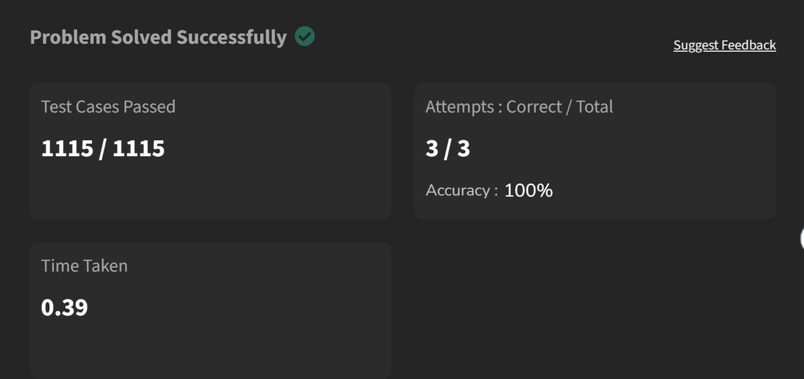
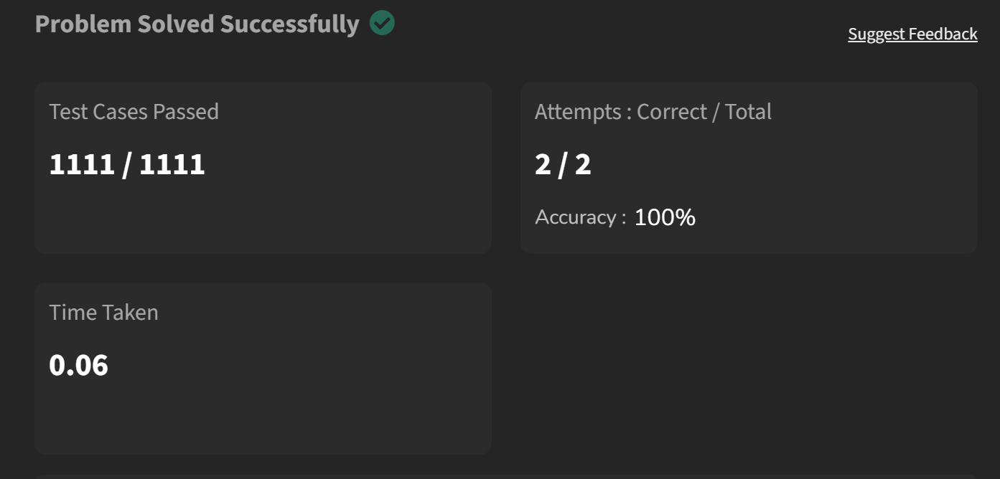
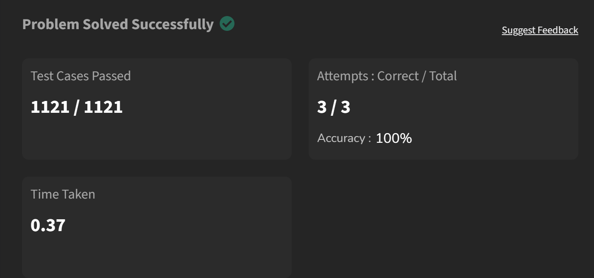
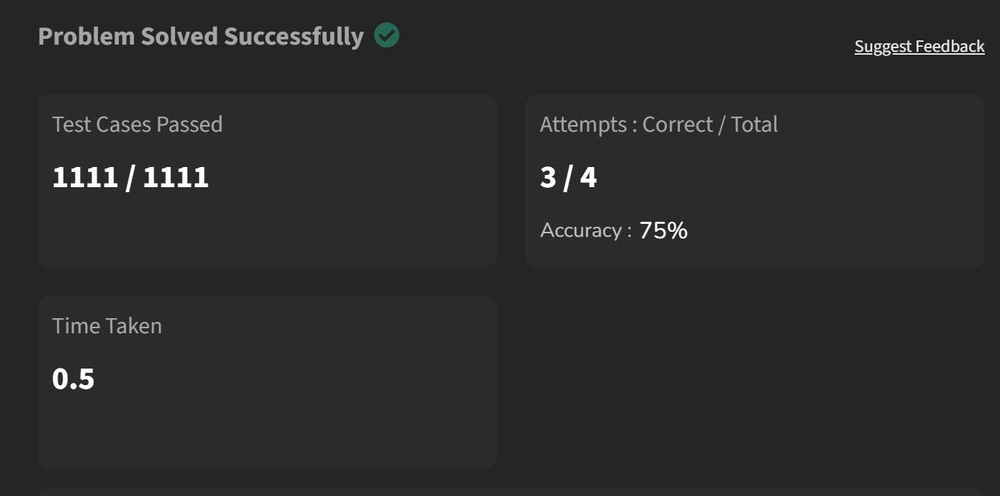
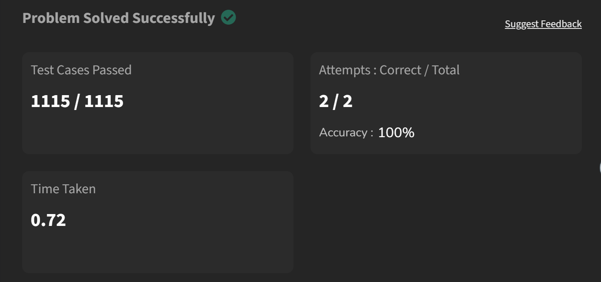
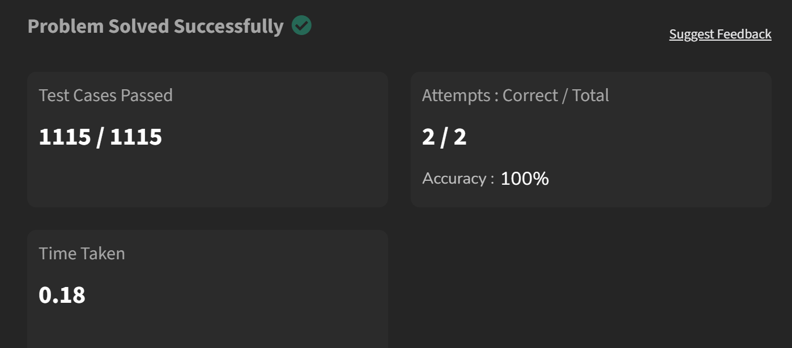
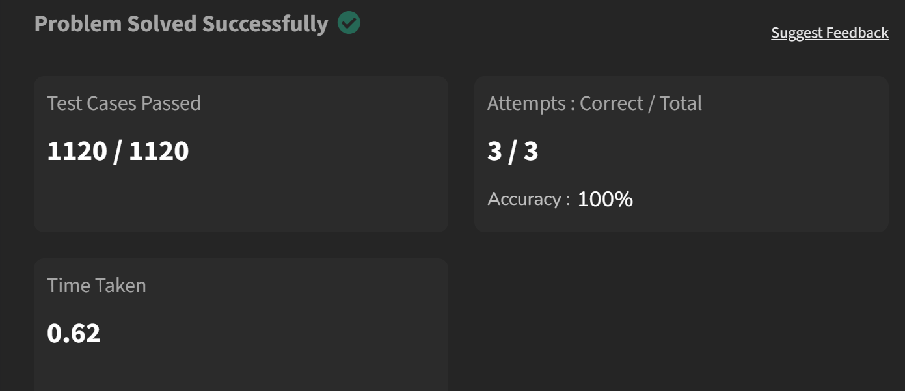

# School of Computer Science and Engineering
## Experiment List for Programming Ability and Logic Building - 1

This document contains common array problems, their Python implementations, and dedicated sections for you to insert screenshots of code execution or logic diagrams.

---

### 1️⃣ Reverse an Array (In-Place)
**Problem:** Reverse the given array by modifying it in place.

**Example:**
- **Input:** `[1, 4, 3, 2, 6, 5]`
- **Output:** `[5, 6, 2, 3, 4, 1]`

**Solution:**
```python
class Solution:
    def reverseArray(self, arr):
        arr.reverse()
        return arr
```



---

### 2️⃣ Find Minimum and Maximum Element
**Problem:** Find the minimum and maximum elements in the array.

**Example:**
- **Input:** `[1, 4, 3, 5, 8, 6]`
- **Output:** `(1, 8)`

**Solution:**
```python
class Solution:
    def getMinMax(self, arr):
        minimum = arr[0]
        maximum = arr[0]

        for i in arr:
            if i < minimum:
                minimum = i
            if i > maximum:
                maximum = i

        return minimum, maximum
```



---

### 3️⃣ Kth Smallest Element
**Problem:** Find the kth smallest element based on sorted order.

**Example:**
- **Input:** `arr = [10, 5, 4, 3, 48, 6, 2, 33, 53, 10], k = 4`
- **Output:** `5`

**Solution:**
```python
class Solution:
    def kthSmallest(self, arr, k):
        arr.sort()
        return arr[k - 1]
```



---

### 4️⃣ Union of Two Arrays
**Problem:** Return all distinct elements present in either array.

**Example:**
- **Input:** `a = [1, 2, 3, 2, 1], b = [3, 2, 2, 3, 3, 2]`
- **Output:** `[1, 2, 3]`

**Solution:**
```python
class Solution:
    def findUnion(self, a, b):
        return sorted(set(a) | set(b))
```



---

### 5️⃣ Largest Element in Array
**Problem:** Find the largest element.

**Example:**
- **Input:** `[1, 8, 7, 56, 90]`
- **Output:** `90`

**Solution:**
```python
class Solution:
    def largest(self, arr):
        arr.sort()
        return arr[-1]
```



---

### 6️⃣ Rotate Array by One (Clockwise)
**Problem:** Rotate the array by one position in clockwise direction.

**Example:**
- **Input:** `[1, 2, 3, 4, 5]`
- **Output:** `[5, 1, 2, 3, 4]`

**Solution:**
```python
class Solution:
    def rotate(self, arr):
        n = len(arr)
        if n == 0: return arr
        last = arr[n - 1]

        for i in range(n - 1, 0, -1):
            arr[i] = arr[i - 1]

        arr[0] = last
        return arr
```



---

### 7️⃣ Maximum Subarray Sum (Kadane’s Algorithm)
**Problem:** Find the maximum sum of a continuous subarray.

**Example:**
- **Input:** `[2, 3, -8, 7, -1, 2, 3]`
- **Output:** `11`

**Solution:**
```python
class Solution:
    def maxSubarraySum(self, arr):
        current_sum = arr[0]
        max_sum = arr[0]

        for i in range(1, len(arr)):
            current_sum = max(arr[i], current_sum + arr[i])
            max_sum = max(max_sum, current_sum)

        return max_sum
```



---

### 8️⃣ Search Insert Position (Binary Search)
**Problem:** Return index if target exists; otherwise return insertion position.

**Example:**
- **Input:** `nums = [1, 3, 5, 6], target = 5`
- **Output:** `2`

**Solution:**
```python
from typing import List

class Solution:
    def searchInsert(self, nums: List[int], target: int) -> int:
        left, right = 0, len(nums) - 1

        while left <= right:
            mid = (left + right) // 2

            if nums[mid] == target:
                return mid
            elif nums[mid] < target:
                left = mid + 1
            else:
                right = mid - 1

        return left
```


---

### 9️⃣ Two Sum
**Problem:** Find indices of two numbers whose sum equals the target.

**Example:**
- **Input:** `nums = [2, 7, 11, 15], target = 9`
- **Output:** `[0, 1]`

**Solution:**
```python
from typing import List

class Solution:
    def twoSum(self, nums: List[int], target: int) -> List[int]:
        # Optimization: Use a hash map for O(n) time complexity
        prevMap = {} # val : index

        for i, n in enumerate(nums):
            diff = target - n
            if diff in prevMap:
                return [prevMap[diff], i]
            prevMap[n] = i
        return []
```


---

### 🔟 Minimum Number of Jumps to Reach End
**Problem:** Each element represents maximum jump length from that position. Return minimum jumps needed to reach the last index.

**Example:**
- **Input:** `[1, 3, 5, 8, 9, 2, 6, 7, 6, 8, 9]`
- **Output:** `3`

**Solution:**
```python
class Solution:
    def minJumps(self, arr):
        n = len(arr)

        if n <= 1:
            return 0
        if arr[0] == 0:
            return -1

        maxReach = arr[0]
        step = arr[0]
        jump = 1

        for i in range(1, n):
            if i == n - 1:
                return jump

            maxReach = max(maxReach, i + arr[i])
            step -= 1

            if step == 0:
                jump += 1
                if i >= maxReach:
                    return -1
                step = maxReach - i

        return -1
```


