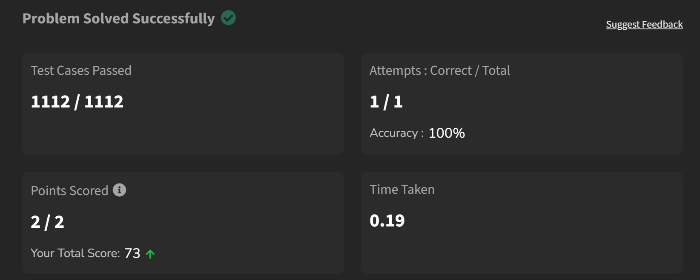

# School of Computer Science and Engineering
## Experiment List for Programming Ability and Logic Building - 2

This document contains common array problems, their Python implementations, and dedicated sections for you to insert screenshots of code execution or logic diagrams.

---

### 1️⃣ Chocolate Distribution Problem
**Problem:** Given an array `arr[]` where each element represents chocolates in a packet and an integer `M` representing students, distribute packets such that each student gets one packet and the difference between maximum and minimum chocolates is minimum.

**Example:**
- **Input:** `arr[] = [7, 3, 2, 4, 9, 12, 56], M = 3`
- **Output:** `2`

**Solution:**
```python
class Solution:
	def findMinDiff(self, arr, M):
		n = len(arr)

		if M == 0 or n == 0:
			return 0
		if M > n:
			return -1

		arr.sort()
		min_diff = float('inf')

		for i in range(n - M + 1):
			diff = arr[i + M - 1] - arr[i]
			min_diff = min(min_diff, diff)

		return min_diff
```



---

### 2️⃣ Minimize the Heights
**Problem:** Given an array `arr[]` denoting heights of towers and a positive integer `k`, modify each tower's height by either increasing or decreasing it by `k` to minimize the difference between the tallest and shortest towers.

**Example:**
- **Input:** `k = 2, arr[] = [1, 5, 8, 10]`
- **Output:** `5`

**Constraints:**
- `1 ≤ k ≤ 10^7`
- `1 ≤ n ≤ 10^5`
- `1 ≤ arr[i] ≤ 10^7`

**Solution:**
```python
class Solution:
	def getMinDiff(self, arr, k):
		n = len(arr)
		arr.sort()
		ans = arr[n - 1] - arr[0]

		smallest = arr[0] + k
		largest = arr[n - 1] - k

		for i in range(n - 1):
			mini = min(smallest, arr[i + 1] - k)
			maxi = max(largest, arr[i] + k)

			if mini < 0:
				continue

			ans = min(ans, maxi - mini)

		return ans
```


---

### 3️⃣ Minimum Jumps to Reach End
**Problem:** Given an array `arr[]` of non-negative numbers, find the minimum number of jumps needed to move from the first position to the last. Return `-1` if the end cannot be reached.

**Example:**
- **Input:** `arr[] = [1, 3, 5, 8, 9, 2, 6, 7, 6, 8, 9]`
- **Output:** `3`

**Solution:**
```python
class Solution:
	def minJumps(self, arr):
		n = len(arr)

		if n <= 1:
			return 0
		if arr[0] == 0:
			return -1

		maxReach = arr[0]
		step = arr[0]
		jump = 1

		for i in range(1, n):
			if i == n - 1:
				return jump

			maxReach = max(maxReach, i + arr[i])
			step -= 1

			if step == 0:
				jump += 1
				if i >= maxReach:
					return -1
				step = maxReach - i

		return -1
```


---

### 4️⃣ Find the Duplicate Number
**Problem:** Given an array `nums` containing `n + 1` integers where each integer is in the range `[1, n]`, return the repeated number without modifying the array and using constant extra space.

**Example:**
- **Input:** `nums = [1, 3, 4, 2, 2]`
- **Output:** `2`

**Solution:**
```python
from typing import List

class Solution:
	def findDuplicate(self, nums: List[int]) -> int:
		slow = nums[0]
		fast = nums[0]

		while True:
			slow = nums[slow]
			fast = nums[nums[fast]]
			if slow == fast:
				break

		slow = nums[0]

		while slow != fast:
			slow = nums[slow]
			fast = nums[fast]

		return slow
```


---

### 5️⃣ Merge Two Sorted Arrays Without Extra Space
**Problem:** Given two sorted arrays `a[]` and `b[]`, merge them in sorted order without using extra space so that `a[]` has first `n` elements and `b[]` has last `m` elements.

**Example:**
- **Input:** `a[] = [2, 4, 7, 10], b[] = [2, 3]`
- **Output:** `a[] = [2, 2, 3, 4], b[] = [7, 10]`

**Solution:**
```python
class Solution:
	def mergeArrays(self, a, b):
		n, m = len(a), len(b)
		gap = (n + m + 1) // 2

		while gap > 0:
			i = 0
			j = gap

			while j < n + m:
				if i < n and j < n:
					if a[i] > a[j]:
						a[i], a[j] = a[j], a[i]
				elif i < n and j >= n:
					if a[i] > b[j - n]:
						a[i], b[j - n] = b[j - n], a[i]
				else:
					if b[i - n] > b[j - n]:
						b[i - n], b[j - n] = b[j - n], b[i - n]

				i += 1
				j += 1

			if gap == 1:
				gap = 0
			else:
				gap = (gap + 1) // 2

		return a, b
```


---

### 6️⃣ Merge Overlapping Intervals
**Problem:** Given an array of intervals, merge all overlapping intervals and return non-overlapping intervals.

**Example:**
- **Input:** `intervals = [[1, 3], [2, 6], [8, 10], [15, 18]]`
- **Output:** `[[1, 6], [8, 10], [15, 18]]`

**Solution:**
```python
from typing import List

class Solution:
	def merge(self, intervals: List[List[int]]) -> List[List[int]]:
		intervals.sort(key=lambda x: x[0])

		slow = 0
		for fast in range(1, len(intervals)):
			if intervals[fast][0] <= intervals[slow][1]:
				intervals[slow][1] = max(intervals[slow][1], intervals[fast][1])
			else:
				slow += 1
				intervals[slow] = intervals[fast]

		return intervals[:slow + 1]
```


---

### 7️⃣ Common Elements in Three Sorted Arrays
**Problem:** Given three sorted arrays, return all common elements in non-decreasing order without duplicates. Return `[-1]` if no common element exists.

**Example:**
- **Input:** `arr1 = [1, 5, 10, 20, 40, 80], arr2 = [6, 7, 20, 80, 100], arr3 = [3, 4, 15, 20, 30, 70, 80, 120]`
- **Output:** `[20, 80]`

**Solution:**
```python
class Solution:
	def commonElements(self, arr1, arr2, arr3):
		i = j = k = 0
		n1, n2, n3 = len(arr1), len(arr2), len(arr3)
		result = []

		while i < n1 and j < n2 and k < n3:
			if arr1[i] == arr2[j] == arr3[k]:
				if not result or result[-1] != arr1[i]:
					result.append(arr1[i])
				i += 1
				j += 1
				k += 1
			elif arr1[i] < arr2[j]:
				i += 1
			elif arr2[j] < arr3[k]:
				j += 1
			else:
				k += 1

		return result if result else [-1]
```


---

### 8️⃣ Factorial of Large Number
**Problem:** Given an integer `n`, return a list of digits representing `n!`.

**Example:**
- **Input:** `n = 10`
- **Output:** `[3, 6, 2, 8, 8, 0, 0]`

**Solution:**
```python
class Solution:
	def factorial(self, n):
		fact = 1
		for i in range(1, n + 1):
			fact *= i
		arr = []
		for i in range(len(str(fact))):
			arr.append(int(str(fact)[i]))
		return arr
```


---

### 9️⃣ Array Subset of Another Array
**Problem:** Given arrays `a[]` and `b[]`, determine whether `b[]` is a subset of `a[]`.

**Example:**
- **Input:** `a[] = [11, 7, 1, 13, 21, 3, 7, 3], b[] = [11, 3, 7, 1, 7]`
- **Output:** `true`

**Solution:**
```python
from collections import Counter

class Solution:
	def isSubset(self, a, b):
		count = Counter(a)

		for x in b:
			if count[x] == 0:
				return False
			count[x] -= 1

		return True
```


---

### 🔟 Triplet Sum in Array
**Problem:** Given an array `arr[]` and integer `target`, determine if there exists a triplet whose sum is exactly `target`.

**Example:**
- **Input:** `arr[] = [1, 4, 45, 6, 10, 8], target = 13`
- **Output:** `true`

**Solution:**
```python
class Solution:
	def hasTripletSum(self, arr, target):
		arr.sort()
		n = len(arr)

		for i in range(n - 2):
			left = i + 1
			right = n - 1

			while left < right:
				total = arr[i] + arr[left] + arr[right]

				if total == target:
					return True
				elif total < target:
					left += 1
				else:
					right -= 1

		return False
```


---

### 1️⃣1️⃣ Trapping Rain Water
**Problem:** Given an array `arr[]` representing block heights where each block has width `1`, compute total water trapped after rain.

**Example:**
- **Input:** `arr[] = [3, 0, 2, 0, 4]`
- **Output:** `7`

**Solution:**
```python
class Solution:
	def maxWater(self, arr):
		n = len(arr)
		left, right = 0, n - 1
		left_max = right_max = 0
		water = 0

		while left <= right:
			if arr[left] <= arr[right]:
				if arr[left] >= left_max:
					left_max = arr[left]
				else:
					water += left_max - arr[left]
				left += 1
			else:
				if arr[right] >= right_max:
					right_max = arr[right]
				else:
					water += right_max - arr[right]
				right -= 1

		return water
```


